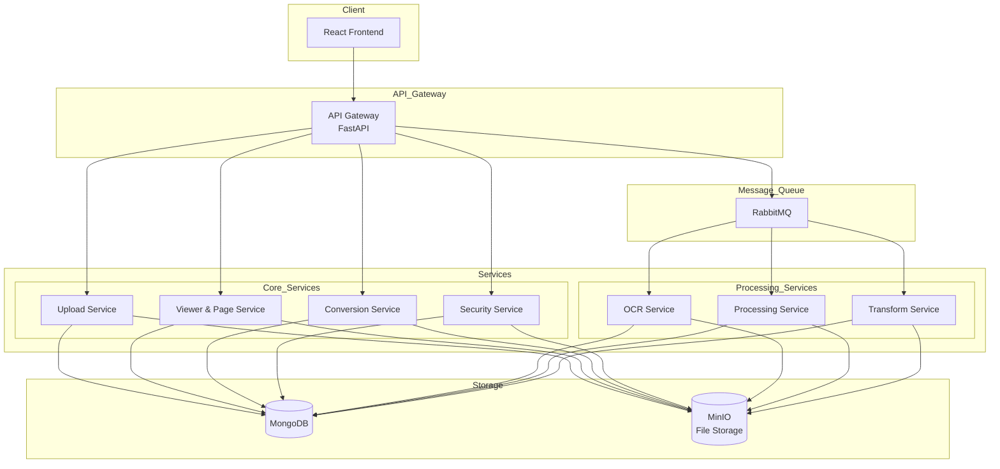

# PDF处理系统架构设计

## 1. 系统整体架构



## 2. 微服务组件说明

### 2.1 前端 (React + TypeScript)
- 现代化响应式界面
- 实时PDF预览和编辑功能
- 支持多语言国际化
- 基于角色的访问控制

### 2.2 核心服务
1. **Upload Service**
   - 文件上传和验证
   - 文件格式检测
   - 病毒扫描
   - 存储管理

2. **Viewer & Page Service**
   - PDF预览
   - 页面操作（合并、分割、旋转）
   - 页面编辑（注释、绘图）
   - 页面布局调整

3. **Conversion Service**
   - PDF转换（图片、Word、HTML等）
   - 格式互转
   - 质量控制
   - 批量处理

4. **Security Service**
   - 密码管理
   - 权限控制
   - 水印处理
   - PDF加密/解密

### 2.3 处理服务
1. **OCR Service**
   - 文字识别
   - 多语言支持
   - 图片预处理
   - 结果优化

2. **Processing Service**
   - 压缩优化
   - 修复损坏
   - 元数据处理
   - 批注处理

3. **Transform Service**
   - 格式转换
   - 文档美化
   - 模板应用
   - 自定义处理

## 3. 技术栈详细说明

### 3.1 前端技术
- React 18+ & TypeScript
- PDF.js 用于PDF渲染
- Ant Design Pro 组件库
- i18next 国际化

### 3.2 后端技术
- FastAPI/Flask 微服务框架
- MongoDB 存储元数据
- MinIO 对象存储
- RabbitMQ 消息队列
- Redis 缓存
- JWT 认证

### 3.3 DevOps
- Docker & Docker Compose
- Kubernetes (可选)
- Prometheus & Grafana 监控
- ELK 日志管理

## 4. 部署架构

```mermaid
graph TB
    subgraph Docker_Compose
        subgraph Frontend
            F[React App]
        end
        
        subgraph Backend
            AG[API Gateway]
            S1[Service 1]
            S2[Service 2]
            S3[Service 3]
            Sn[Service n]
        end
        
        subgraph Infrastructure
            MQ[RabbitMQ]
            DB[(MongoDB)]
            Cache[(Redis)]
            FS[(MinIO)]
        end
        
        subgraph Monitoring
            P[Prometheus]
            G[Grafana]
            ELK[ELK Stack]
        end
    end
    
    F --> AG
    AG --> S1 & S2 & S3 & Sn
    S1 & S2 & S3 & Sn --> MQ
    S1 & S2 & S3 & Sn --> DB
    S1 & S2 & S3 & Sn --> Cache
    S1 & S2 & S3 & Sn --> FS